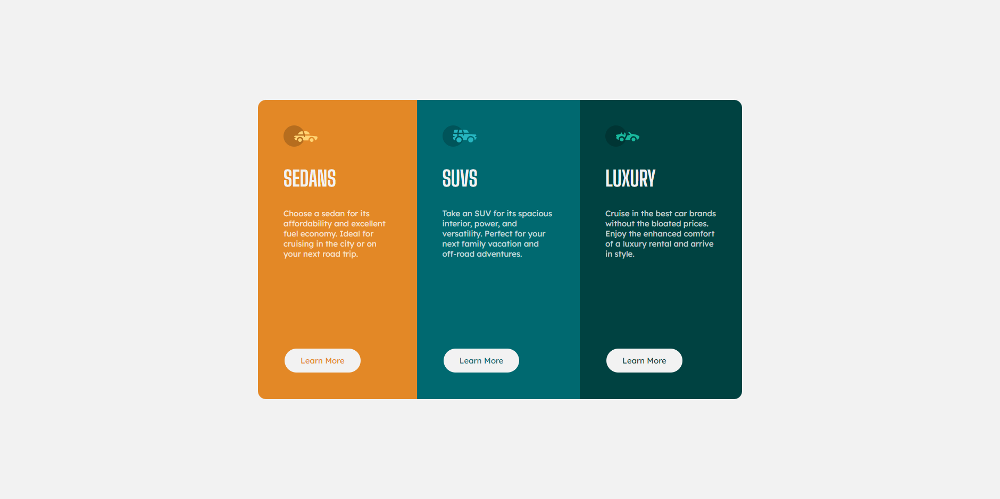

# Frontend Mentor - 3-column preview card component solution

This is a solution to the [3-column preview card component challenge on Frontend Mentor](https://www.frontendmentor.io/challenges/3column-preview-card-component-pH92eAR2-).

## Table of contents

- [Overview](#overview)
  - [The challenge](#the-challenge)
  - [Screenshot](#screenshot)
  - [Links](#links)
- [My process](#my-process)
  - [Built with](#built-with)
- [Author](#author)

## Overview

### The challenge

The challenge was to recreate the website based on provided images. Users should be able to:

- View the optimal layout depending on their device's screen size
- See hover states for interactive elements

### Screenshot

#### Preview

#### My solution

### Links

- Solution URL: [https://github.com/joaskr/3-column-preview-card-component](https://github.com/joaskr/3-column-preview-card-component)
- Live Site URL: [https://3-column-preview-card-component-joaskr.vercel.app](https://3-column-preview-card-component-joaskr.vercel.app)

## My process

### Built with

- Semantic HTML5 markup
- CSS
- Flexbox
- Mobile-first workflow

## Author

- Frontend Mentor - [@joaskr](https://www.frontendmentor.io/profile/joaskr)
- Github - [@joaskr](https://www.frontendmentor.io/profile/joaskr)

